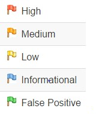

# Estudo da Ferramenta OWASP ZAP

Estudo sobre o funcionamento da ferramenta [OWASP ZAP](https://owasp.org/www-project-zap/).

## O que é

O Zed Attack Proxy (ZAP) é uma ferramenta gratuita de teste de penetração de código aberto que é mantida sob a égide do OWASP (Open Web Application Security Project). O ZAP foi projetado especificamente para testar aplicativos da Web e é flexível e extensível.

No fundo, o ZAP é o que é conhecido como um "proxy intermediário". Ele fica entre o navegador do testador e o aplicativo da Web, para que ele possa interceptar e inspecionar as mensagens enviadas entre o navegador e o aplicativo da Web, modificar o conteúdo se necessário e, em seguida, encaminhe esses pacotes para o destino. Ele pode ser usado como um aplicativo independente e como um processo daemon.

## Como instalar / configurar

Fazer o download do instalador [ZAP](https://www.zaproxy.org/download/). O ZAP necessita do Java 8+ para sua execução. O instalador para Mac Os já inclui a versão do Java necessária. Para Linux, Windows e demais plataformas é necessário realizar a instalação separadamente.  

## Como funciona

O ZAP rastreia o aplicativo da Web com seu Spider e passivamente examina cada página que encontrar. Em seguida, o ZAP usa o scanner ativo para atacar todas as páginas, funcionalidades e parâmetros descobertos.

O ZAP varrerá passivamente todas as solicitações e respostas enviadas por proxy. A varredura passiva é boa para encontrar algumas vulnerabilidades e como uma maneira de entender o estado básico de segurança de um aplicativo Web e localizar onde mais investigações podem ser necessárias.

A verificação ativa, no entanto, tenta encontrar outras vulnerabilidades usando ataques conhecidos contra os destinos selecionados.

Alguns ataques utilizados são:

- **Path Traversal:** Um ataque de Path Traversal (também conhecido como travessia de diretório) visa acessar arquivos e diretórios armazenados fora da pasta raiz da web. Manipulando variáveis que referenciam arquivos com sequências "ponto-ponto-barra (../)" e suas variações ou usando caminhos de arquivo absolutos, pode ser possível acessar arquivos e diretórios arbitrários armazenados no sistema de arquivos, incluindo código-fonte ou configuração do aplicativo e arquivos críticos do sistema. Fonte: OWASP
- **Remote File Inclusion:** A inclusão remota de arquivo (RFI) é um ataque direcionado a vulnerabilidades em aplicativos Web que referenciam dinamicamente scripts externos. O objetivo do autor é explorar a função de referência em um aplicativo para fazer upload de malware (por exemplo, shells backdoor) de um URL remoto localizado em um domínio diferente.
As conseqüências de um ataque RFI bem-sucedido incluem roubo de informações, servidores comprometidos e aquisição do site que permite a modificação do conteúdo. Fonte: Imperva
- **URL Redirector Abuse:** Os aplicativos aceitam URLs arbitrários definidos pelo usuário como entrada, que são usados como destinos para o redirecionamento. Os usuários podem ser redirecionados involuntariamente para um site malicioso de um site em que confiam. Fonte: OWASP
- **Server side include:** SSIs são diretrizes presentes em aplicativos da Web usados ​​para alimentar uma página HTML com conteúdo dinâmico. SSIs são usados ​​para executar algumas ações antes que a página atual seja carregada ou enquanto a página está sendo visualizada. Para fazer isso, o servidor da Web analisa o SSI antes de fornecer a página ao usuário.
O ataque Inclui do lado do servidor permite a exploração de um aplicativo da Web injetando scripts em páginas HTML ou executando códigos arbitrários remotamente. Ele pode ser explorado através da manipulação do SSI em uso no aplicativo ou forçar seu uso através dos campos de entrada do usuário. Fonte: OWASP
- **Cross Site Scripting:** Os ataques XSS (Cross-Site Scripting) são um tipo de injeção, na qual scripts maliciosos são injetados em sites benignos e confiáveis. Os ataques XSS ocorrem quando um invasor usa um aplicativo da Web para enviar código malicioso, geralmente na forma de um script do lado do navegador, para um usuário final diferente. As falhas que permitem que esses ataques sejam bem-sucedidos são bastante difundidas e ocorrem em qualquer lugar em que um aplicativo Web use entrada de um usuário na saída gerada sem validá-lo ou codificá-l o.
Um invasor pode usar o XSS para enviar um script mal-intencionado a um usuário inocente. O navegador do usuário final não tem como saber que o script não deve ser confiável e o executará. Como ele acredita que o script veio de uma fonte confiável, o script mal-intencionado pode acessar todos os cookies, tokens de sessão ou outras informações confidenciais retidas pelo navegador e usadas com esse site. Esses scripts podem até reescrever o conteúdo da página HTML. Fonte: OWASP
- **SQL Injection:** Um ataque de injeção SQL consiste na inserção ou "injeção" de uma consulta SQL através dos dados de entrada do cliente para o aplicativo. Uma exploração bem-sucedida da injeção SQL pode ler dados confidenciais do banco de dados, modificar dados do banco de dados (Inserir / Atualizar / Excluir), executar operações de administração no banco de dados (como desligar o DBMS), recuperar o conteúdo de um determinado arquivo presente no arquivo DBMS sistema e, em alguns casos, emita comandos para o sistema operacional. Os ataques de injeção SQL são um tipo de ataque de injeção, no qual comandos SQL são injetados na entrada do plano de dados para efetuar a execução de comandos SQL predefinidos. Fonte: OWASP
- **Forced browsing:** Forced browsing é um ataque em que o objetivo é enumerar e acessar recursos que não são referenciados pelo aplicativo, mas ainda estão acessíveis. Fonte: OWASP
- **Session ID in URL rewrite:** As funções de aplicativos relacionadas à autenticação e gerenciamento de sessões geralmente não são implementadas corretamente, permitindo que os invasores comprometam senhas, chaves ou tokens de sessão ou explorem outras falhas de implementação para assumir a identidade de outros usuários. Fonte: jasonroell
- **Secure page browser cache:** O impacto de uma resposta criada com códigos maliciosos pode ser aumentado se for armazenado em cache por um cache da Web usado por vários usuários ou mesmo pelo cache do navegador de um único usuário. Se uma resposta for armazenada em cache em um cache da Web compartilhado, como os comumente encontrados em servidores proxy, todos os usuários desse cache continuarão recebendo o conteúdo malicioso até que a entrada do cache seja removida. Da mesma forma, se a resposta for armazenada em cache no navegador de um usuário individual, ele continuará recebendo o conteúdo malicioso até que a entrada do cache seja removida, embora apenas o usuário da instância do navegador local seja afetado. Fonte: OWASP
- **CRLF injection:** O termo CRLF refere-se ao Carriage Return (ASCII 13, \ r) Line Feed (ASCII 10, \ n). Eles costumavam observar o término de uma linha, no entanto, tratado de maneira diferente nos populares sistemas operacionais de hoje. Por exemplo: no Windows, é necessário um CR e LF para observar o final de uma linha, enquanto no Linux / UNIX, um LF é necessário apenas. No protocolo HTTP, a sequência CR-LF é sempre usada para terminar uma linha.
Um ataque de injeção de CRLF ocorre quando um usuário consegue enviar um CRLF para um aplicativo. Isso geralmente é feito modificando um parâmetro HTTP ou URL. Fonte: OWASP
- **Parameter tampering:** O ataque de Parameter tampering da Web é baseado na manipulação de parâmetros trocados entre cliente e servidor, a fim de modificar os dados do aplicativo, como credenciais e permissões de usuário, preço e quantidade de produtos, etc. Geralmente, essas informações são armazenadas em cookies, de forma oculta campos ou cadeias de consulta de URL e é usado para aumentar a funcionalidade e o controle do aplicativo.
- **Fuzzer:** O teste do Fuzz ou Fuzzing é uma técnica de teste , que consiste basicamente em encontrar bugs de implementação usando injeção de dados malformada / semi-malformada de maneira automatizada.

## Quão complexo é o seu uso

O uso manual da ferramenta é de complexidade mediana, já o seu uso automatizado requer um conhecimento mais avançado. A análise dos resultados encontrados, bem como as atitudes que devem ser tomadas para corrigir possíveis problemas, requer um conhecimento elevado sobre segurança da informação e programação defensiva.

## Quais parâmetros são levados em consideração para mensurar a vulnerabilidade do sistema

Os testes de segurança geralmente são divididos de maneira arbitrária, de acordo com o tipo de vulnerabilidade sendo testada ou o tipo de teste sendo realizado.

Os tipos de testes que podem ser realizados são:

- **Avaliação de vulnerabilidade:** O sistema é verificado e analisado quanto a problemas de segurança.

- **Teste de penetração:** O sistema passa por análise e ataque de invasores mal-intencionados simulados.

- **Teste de tempo de execução:** O sistema passa por análise e teste de segurança de um usuário final.

- **Revisão de código:** O código do sistema passa por uma revisão e análise detalhadas procurando especificamente por vulnerabilidades de segurança.

A medida que o ZAP monitora seu aplicativo da Web, ele cria um mapa das páginas dos aplicativos da Web e os recursos usados ​​para renderizar essas páginas. Em seguida, ele registra as solicitações e respostas enviadas a cada página e cria alertas se houver algo potencialmente errado com uma solicitação ou resposta.

O ZAP realiza a contagem dos alertas encontrados durante o teste, divididos em categorias de risco. Essas categorias de risco são:

A partir dos alertas gerados é possível mensurar a quantidade de falhas que um sistema possui.

## Glossário

**Spider:** A Spider ZAP descobre links examinando o HTML nas respostas do aplicativo da web. Fonte: Site oficial Zap Proxy
**Programação defensiva:** É um conjunto de técnicas de projeto (do inglês design) e programação objetivando a estabilidade e a segurança de um software independentemente de seu imprevisível. A ideia pode ser vista como forma de reduzir ou eliminar a hipótese de as Leis de Murphy terem efeito. Técnicas de programação defensiva começaram a ser desenvolvidas quando sistemas de software começaram a possibilitar efeitos catastróficos, seja deliberadamente ou inadvertidamente. Fonte: Wikipédia
